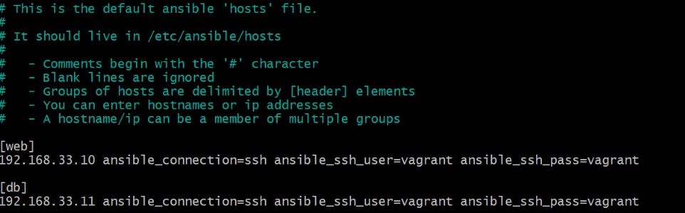
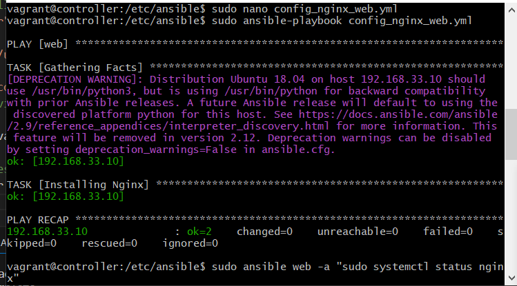
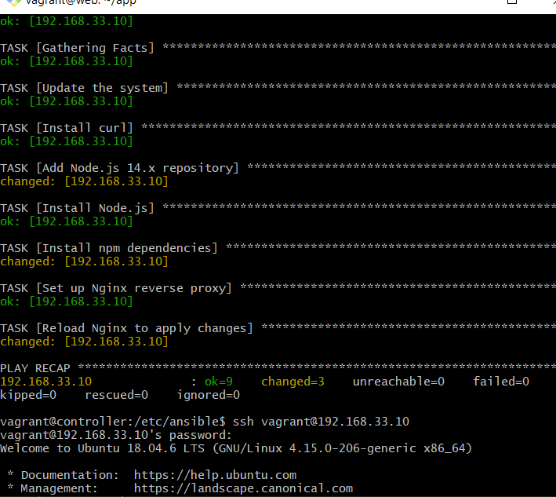
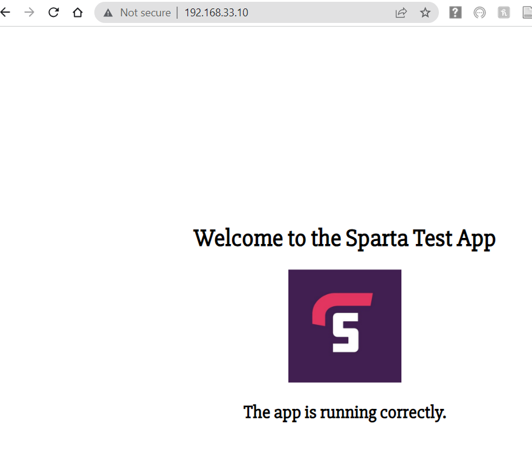
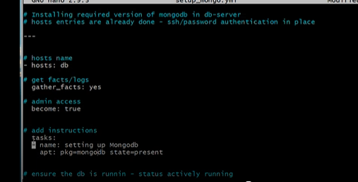

## Setting up and upgrading Virtual Machines

1. Download the vagrantfile provided into the same folder as your README.md for IaC

 In this, three virtual machines are configured. It has provisions for a controller, web application and database with the following network configurations:

controller: 192.168.33.12

web: 192.168.33.10

db: 192.168.33.11


2. Run 'vagrant up'

Make sure you have Virtual Box open. As 'vagrant up' is happening, you should start seeing the 3 vms (controller, web, and db) come up and eventually say 'running'.

4. To check the status of the vms, use the command:

```
vagrant status
```

5. SSH into each vm (one after the other), and run:

```
sudo apt-get update -y
sudo apt-get upgrade -y
```

## Setting up the Ansible Controller

1. First we need to ssh into the controller:
```
Vagrabt ssh controller
ssh vagrant@192.168.33.12
```

2. Then Set up connections to web and db VMs
 - ssh into web VM from controller VM

```
ssh vagrant@192.168.33.10
```
- confirm that you are adding host for first time
(yes)

 - enter password as vagrant (this will look invisable)
password:vagrant

- Exit controller
exit


3. ssh into the db from the controller

```
ssh vagrant@192.168.33.11
```

enter yes again when prompted

for password - vagrant

exit

4. we also need to install common packages, add the Ansible repo, and install ansible:

```
sudo apt install software-properties-common

sudo apt-add-repository ppa:ansible/ansible

sudo apt-get update -y

sudo apt install ansible -y
```

To check if ansible 2.9.27 is installed do 'sudo ansible --version'

```
cd /etc/ansible
sudo apt install tree
tree
```


5. You can then change the configs

```
sudo nano hosts
```

6. In the terminal that appears, add the two lines (so ansible knows node agents addresses and login details):

```
[web]

192.168.33.10 ansible_connection=ssh ansible_ssh_user=vagrant ansible_ssh_pass=vagrant

[db]

192.168.33.11 ansible_connection=ssh ansible_ssh_user=vagrant ansible_ssh_pass=vagrant
```



8. Save and exit this.

9. Then test the connections (to get pings):

```
sudo ansible all -m ping
```


To ping app:

```
sudo ansible web -m ping
```

To ping db:

```
sudo ansible db -m ping
```


## Blockers

If this did not work, try the following:

```
sudo nano ansible.config
```

From here, find the default section, and remove the '#' from the 'host_key_checking=false' line.


You can also go to the SSH conection section and add 'host_key_checking=false' 

You can then run the 'sudo ansible all -m ping' command again to test if it was successful. 


## Ansible - Web Server Configuration 

These use YAML

1. Creating a playbook for installing nginx in web server:

```
sudo nano config_nginx_web.yml
```

Inside this, add the following:

```
# add --- to start YAML file
---
# add name of the host
- hosts: web
# gather additional facts about the steps (optional)
  gather_facts: yes
# add admin access to this file
  become: true
# add instructions (i.e. TASKS) (to install nginx):
# install nginx
  tasks:
  - name: Installing Nginx
    apt: pkg=nginx state=present # starts and ensures present,state=absent stops/removes
# enable nginx
```

2. Run the playbook:

```
sudo ansible-playbook config_nginx_web.yml
```



To check status

```
sudo ansible web -a "sudo systemctl status nginx"
```

You should see the output say 'active: active (running)'


## Copying over the app folder from GitHub to ansible controller

```
sudo apt-get update
sudo apt-get install git
sudo git clone https://github.com/alema/app.git

```
## Copying the app folder to web 

```
sudo ansible web -m copy -a "src=/etc/ansible/app dest=/home/vagrant"
sudo ansible web -a "ls"
```


## Installing Node, npm and starting app with reverse proxy setup

1. Create a playbook:

```
sudo nano start-app.yml
```

Add the following:
```
---
- name: Setup Node.js environment and start app on web VM
  hosts: web
  become: yes

  tasks:
    - name: Gathering Facts
      setup:

    - name: Update the system
      apt:
        update_cache: yes

    - name: Install curl
      apt:
        name: curl
        state: present

    - name: Add Node.js 14.x repository
      shell: curl -sL https://deb.nodesource.com/setup_14.x | bash -
      args:
        warn: false

    - name: Install Node.js
      apt:
        name: nodejs
        state: present


    - name: Install npm dependencies
      command: npm install
      args:
        chdir: /home/vagrant/app

    - name: Set up Nginx reverse proxy
      replace:
        path: /etc/nginx/sites-available/default
        regexp: 'try_files \$uri \$uri/ =404;'
        replace: 'proxy_pass http://localhost:3000/;'

    - name: Reload Nginx to apply changes
      systemd:
        name: nginx
        state: reloaded

    -

```

2. Start the playbook:

```
sudo ansible-playbook start-app.yml
```



3. 

```
ssh vagrant@192.168.33.10
(you will then be prompted to enter password)
cd into app
npm start
```

You should then be able to acces the app page:




## Ansible - Database Server Configuration

1. SSH controller


2. sudo ansible all -m ping


3. cd /etc/ansible                                                         


4. create a yml file:

```
sudo nano setup-mongo.yml
```

5. Enter the following in the yml file:

```
# Installing required version of mongo db
# hosts entries are already done  - ssh / password authentication is in place

---
# hosts name

- hosts: db

# gather facts (logs)

  gather_facts: yes

# admin access

  become: true

# add instructions
  tasks:
  - name: setting up mongo db
    apt: pkg=mongodb state=present

# ensure the db is running - status actively running
 
```



6. Run the playbook:

```
sudo ansible-playbook setup-mongo.yml
```

7. check the status:

```
sudo ansible db -a "sudo systemctl status mongod"
```

**note** - If the playbook worked successfuly, you should see the active: active (running status)


8. SSH into db:

ssh vagrant@192.168.33.11
(add same password as usual when prompted)


9. Now we want to do the configuration


```
sudo nano /etc/mongodb.conf
```

5. Make sure the bind_ip is set to 0.0.0.0


6. We need to make sure the new configuration kicks in:

```
sudo systemctl restart mongodb
sudo systemctl enable mongodb
```

7. Check that the status is active and running:

```
sudo systemctl status mongodb
```

8. Exit and return to controller machine (vagrant@controller:/etc/ansible$)


9. SSH into web

```
ssh vagrant@192.168.33.10
```

10. Create a persistant env variable called DB_HOST=db-ip:27017/posts

```
~/.bashrc
add (export DB_HOST=mongodb://192.168.33.11:27017/posts) to end of file
source ~/.bashrc

```
You can use the 'printenv' command to check that it has worked

11. Navigate to app folder (cd app)

12. Make sure that the database has been seeded and cleared:

```
node seeds/seed.js 
```

13. Run 'Npm start' 
 
 You should be able to see all the 3 pages for the app


## Automating in a playbook:
```
  tasks:
  - name: Setting up mongo db
    apt: pkg=mongodb state=present

  - name: Change bind ip
    replace:
      path: /etc/mongodb.conf
      regexp: 'bind_ip = 127.0.0.1'
      replace: 'bind_ip = 0.0.0.0'
    become: true

  - name: Uncomment port
    replace:
      path: /etc/mongodb.conf
      regexp: '#port = 27017'
      replace: 'port = 27017'
    become: true

  - name: Restart mongodb
    service:
      name: mongodb
      state: restarted
    become: true

  - name: Enable mongodb
    service:
      name: mongodb
      state: started
      enabled: yes
    become: true

    ```

