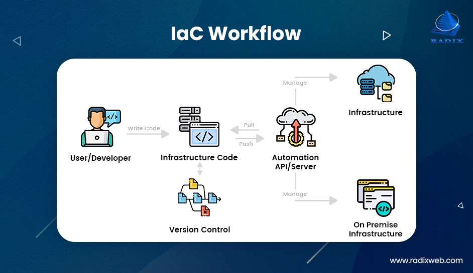
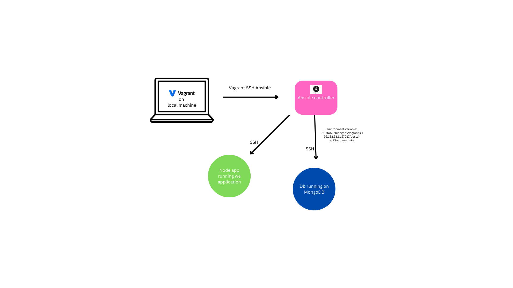
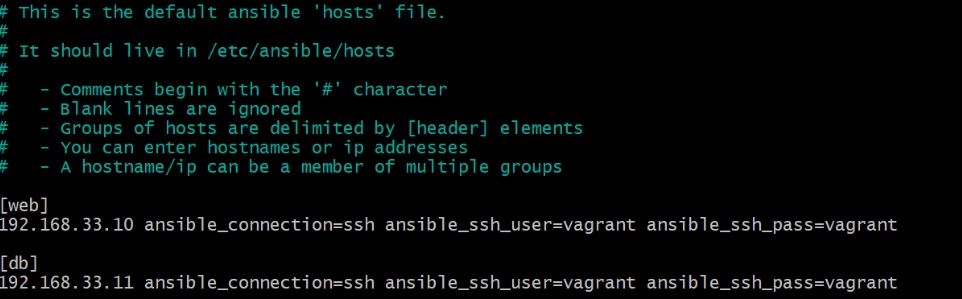
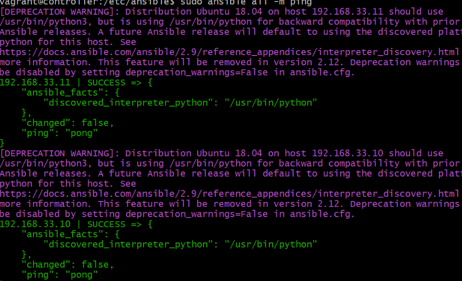
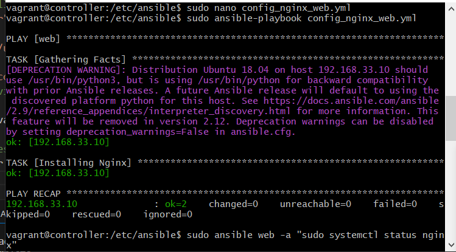
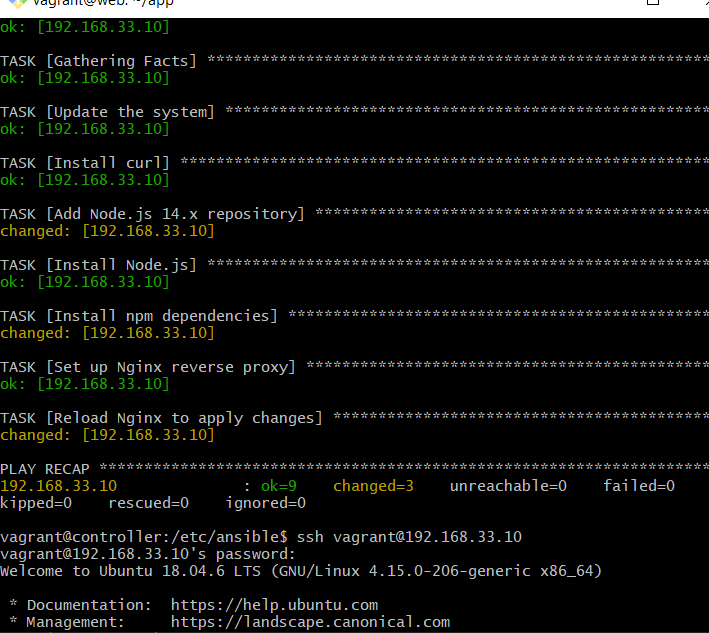
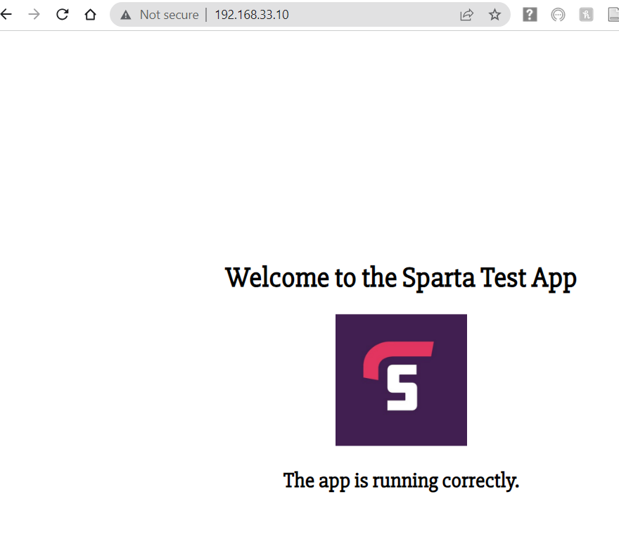

IAC helps us to codify any mannual process. 

Infrastructure as Code (IaC) is a concept that involves managing and provisioning infrastructure resources, such as servers, networks, and storage, through machine-readable configuration files or scripts. It treats infrastructure configuration and deployment as code, allowing for automated and version-controlled management.  This approach eliminates manual setup and configuration, reduces human errors, and facilitates collaboration among teams. IaC allows for faster and more reliable infrastructure deployment'



## Ansible 

Ansible is an open-source automation tool that simplifies the management and provisioning of computer systems. It allows for the configuration, deployment, and orchestration of infrastructure, making it easier to automate repetitive tasks, streamline workflows, and allows for consistent system states across multiple servers.




## Why Ansible?

It is a extremely powerful, simple, and agentless automation tool

**Powerful** - Ansible can manage and facilitate 2 to thousands of servers. You can have different tasks being conducted on different servers all at the same time

**Simple** - Ansible only requires a few lines of code 

**Agentless** - It is agentless, meaning that only the controller needs to have ansible installed. This is beneficial ass if you have lots of servers, e.g., 200, all of these do not need to have ansible installed, helpting to save lots of time. 


## Setting up and upgrading VMs

1. Download the vagrantfile provided into the same folder as your README.md for IaC

 In this, three virtual machines are configured. It has provisions for a controller, web application and database with the following network configurations:

controller: 192.168.33.12

web: 192.168.33.10

db: 192.168.33.11


2. Run 'vagrant up'

Make sure you have Virtual Box open. As 'vagrant up' is happening, you should start seeing the 3 vms (controller, web, and db) come up and eventually say 'running'.

4. To check the status of the vms, use the command:

```
vagrant status
```

5. SSH into each vm (one after the other), and run:

```
sudo apt-get update -y
sudo apt-get upgrade -y
```

## Setting up the Ansible Controller

1. First we need to ssh into the controller:
```
Vagrabt ssh controller
ssh vagrant@ 192.168.33.12
```

2. Then Set up connections to web and db VMs
 - ssh into web VM from controller VM

```
ssh vagrant@192.168.33.10
```
- confirm that you are adding host for first time
(yes)

 - enter password as vagrant (this will look invisable)
password:vagrant

- Exit controller
exit


3. ssh into the db from the controller

```
vagrant ssh 192.168.33.11
```

enter yes again when prompted

for password - vagrant

exit

4. we also need to install common packages, add the Ansible repo, and install ansible:

```
sudo apt install software-properties-common

sudo apt-add-repository ppa:ansible/ansible

sudo apt-get update -y

sudo apt install ansible -y
```

To check if ansible 2.9.27 is installed do 'sudo ansible --version'

```
cd /etc/ansible
sudo apt install tree
tree
```


5. You can then change the configs

```
sudo nano hosts
```

6. In the terminal that appears, add the two lines (so ansible knows node agents addresses and login details):

```
[web]

192.168.33.10 ansible_connection=ssh ansible_ssh_user=vagrant ansible_ssh_pass=vagrant

[db]

192.168.33.11 ansible_connection=ssh ansible_ssh_user=vagrant ansible_ssh_pass=vagrant
```



8. Save and exit this.

9. Then test the connections (to get pings):

```
sudo ansible all -m ping
```


To ping app:

```
sudo ansible web -m ping
```

To ping db:

```
sudo ansible db -m ping
```


## Blockers

If this did not work, try the following:

```
sudo nano ansible.config
```

From here, find the default section, and remove the '#' from the 'host_key_checking=false' line.


You can also go to the SSH conection section and add 'host_key_checking=false' 

You can then run the 'sudo ansible all -m ping' command again to test if it was successful. 


## Ansible Playbooks 

These use YAML

1. Creating a playbook for installing nginx in web server:

```
sudo nano config_nginx_web.yml
```

Inside this, add the following:

```
# add --- to start YAML file
---
# add name of the host
- hosts: web
# gather additional facts about the steps (optional)
  gather_facts: yes
# add admin access to this file
  become: true
# add instructions (i.e. TASKS) (to install nginx):
# install nginx
  tasks:
  - name: Installing Nginx
    apt: pkg=nginx state=present # starts and ensures present,state=absent stops/removes
# enable nginx
```

2. Run the playbook:

```
sudo ansible-playbook config_nginx_web.yml
```



To check status

```
sudo ansible web -a "sudo systemctl status nginx"
```

You should see the output say 'active: active (running)'


## Copying over the app folder from GitHub to ansible controller

```
sudo apt-get update
sudo apt-get install git
sudo git clone https://github.com/alema/app.git

```
## Copying the app folder to web 

```
sudo ansible web -m copy -a "src=/etc/ansible/app dest=/home/vagrant"
sudo ansible web -a "ls"
```


## Installing Node, pm2, npm and starting app with reverse proxy setup

1. Create a playbook:

```
sudo nano start-app.yml
```

Add the following:
---
- name: Setup Node.js environment and start app on web VM
  hosts: web
  become: yes

  tasks:
    - name: Gathering Facts
      setup:

    - name: Update the system
      apt:
        update_cache: yes

    - name: Install curl
      apt:
        name: curl
        state: present

    - name: Add Node.js 14.x repository
      shell: curl -sL https://deb.nodesource.com/setup_14.x | bash -
      args:
        warn: false

    - name: Install Node.js
      apt:
        name: nodejs
        state: present


    - name: Install npm dependencies
      command: npm install
      args:
        chdir: /home/vagrant/app

    - name: Set up Nginx reverse proxy
      replace:
        path: /etc/nginx/sites-available/default
        regexp: 'try_files \$uri \$uri/ =404;'
        replace: 'proxy_pass http://localhost:3000/;'

    - name: Reload Nginx to apply changes
      systemd:
        name: nginx
        state: reloaded

    -

```

2. Start the playbook:

```
sudo ansible-playbook node_pm2_appstart.ym
```



3. 

```
ssh vagrant@192.168.33.10
(you will then be prompted to enter password)
cd into app
npm start
```

You should then be able to acces the app page:

