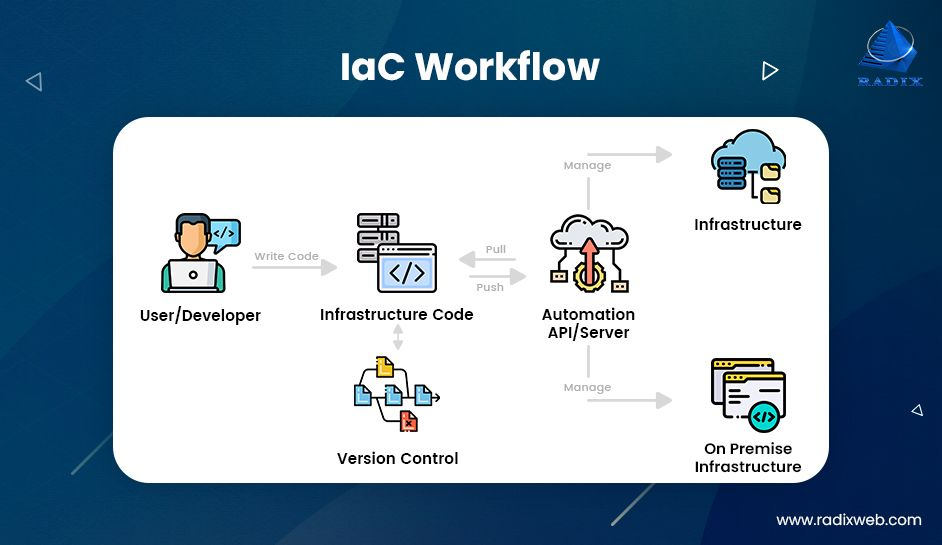

##**Infrastructure as Code**

IAC helps us to codify any mannual process. 

It is a concept that involves managing and provisioning infrastructure resources, such as servers, networks, and storage, through machine-readable configuration files or scripts. 

It treats infrastructure configuration and deployment as code, allowing for automated and version-controlled management.  This approach eliminates manual setup and configuration, reduces human errors, and facilitates collaboration among teams. 

 = IaC allows for faster and more reliable infrastructure deployment.

## Ansible 

Ansible is an open-source automation tool that lets you manage IT infrastructure.

It allows for the configuration, deployment, and orchestration of infrastructure, making it easier to automate repetitive tasks, streamline workflows, and allows for consistent system states across multiple servers.

## Why Ansible?

It is a extremely powerful, simple, and agentless automation tool

**Powerful** - Ansible can manage and facilitate 2 to thousands of servers. You can have different tasks being conducted on different servers all at the same time

**Simple** - Ansible only requires a few lines of code 

**Agentless** - It is agentless, meaning that only the controller needs to have ansible installed. This is beneficial ass if you have lots of servers, e.g., 200, all of these do not need to have ansible installed, helpting to save lots of time. 

